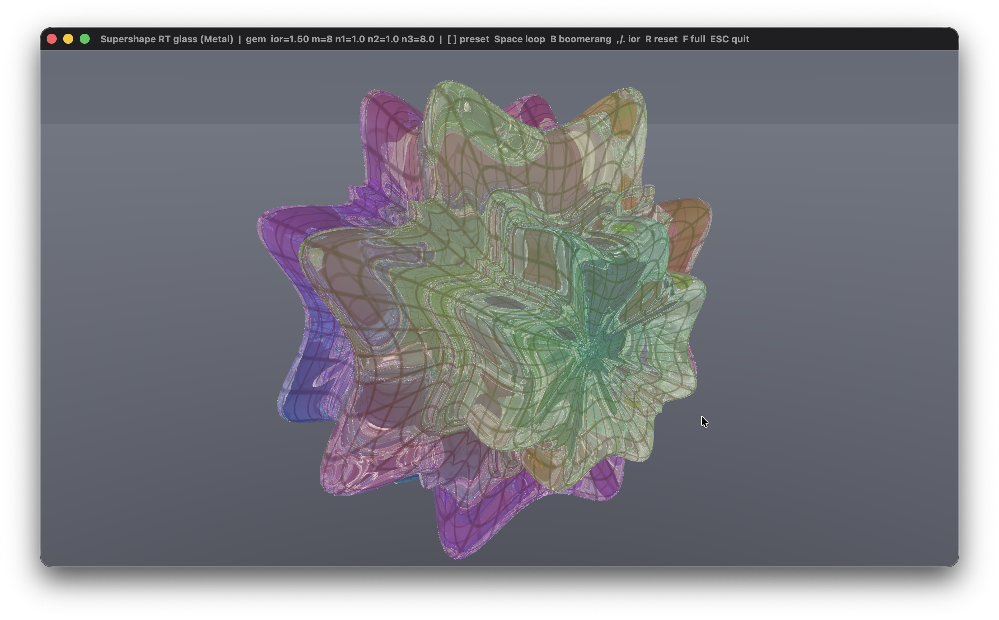

# Supershape — ray-traced glass (Metal)

A real-time **hardware ray tracer** for a 3D supershape, rendered as **coloured
glass**. The body is generated from Gielis' superformula (the spherical product
of two superformulas), packed into an `MTLAccelerationStructure`, and traced
inline from a full-screen fragment shader. One ray per pixel is followed through
a dielectric material with reflection and refraction, so you see the studio
background *through* the body, tinted by an animated rainbow hue, with the UV
grid surviving as darker veins in the glass and bright Fresnel highlights along
the rim. Written in Swift with **Metal / MetalKit**, no third-party libraries.

This is the ray-traced sibling of the rasterised supershape renderer. The
CPU-side math and mesh are identical (positions from the parametric equations,
normals by central finite differences); only the draw path changed from
rasterisation to ray tracing.

## Screenshot


## The surface

A 2D superformula gives a radius as a function of angle:

```
r(θ) = ( |cos(m·θ/4)|^n2 + |sin(m·θ/4)|^n3 ) ^ (-1/n1)
```

The 3D body is the spherical product of one ring in longitude and one in
latitude:

```
r1 = superformula(θ ; m1, n1a, n1b, n1c)   θ ∈ [-π, π]
r2 = superformula(φ ; m2, n2a, n2b, n2c)   φ ∈ [-π/2, π/2]

x = r1·cos(θ) · r2·cos(φ)
y = r1·sin(θ) · r2·cos(φ)
z =            r2·sin(φ)
```

- **`m`** — symmetry / number of lobes (`m = 0` is a sphere).
- **`n1`** — overall pinch; **`n2`, `n3`** bend the edges convex or concave.

Vertex normals come from central finite differences of the position function, so
they stay correct for any parameter set. At the default tessellation
(`Nu = 200`, `Nv = 140`) the surface is ~28k vertices / ~168k triangles.

## The glass

Each pixel casts a primary ray and bounces up to eight times. At every surface
hit the shader interpolates the triangle's normal and UV from the barycentric
coordinates, then:

- computes exact **dielectric Fresnel** to split energy between reflection and
  refraction,
- adds the reflection as a sample of a procedural studio environment (this is
  what gives the bright rim and glints),
- **refracts** the ray onward through the body, multiplying its throughput by a
  **tint** taken from the same animated rainbow hue, so the glass reads as
  coloured,
- darkens the throughput along the **grid** lines, so the UV grid shows up as
  veins seen through the glass,
- handles **total internal reflection** when refraction is impossible.

The transmitted ray eventually leaves the body and hits the environment, so the
background is visible through the glass. A light filmic tone map and gamma keep
the Fresnel highlights from clipping. Change the **index of refraction** live to
go from near-water to dense crystal.

## Controls

| Input             | Action                              |
| ----------------- | ----------------------------------- |
| Mouse drag        | Rotate                              |
| Scroll            | Zoom                                |
| `[` / `]`         | Previous / next preset              |
| `Space`           | Toggle looping morph through presets |
| `B`               | Toggle boomerang morph (forward, then back) |
| `,` / `.`         | Index of refraction down / up       |
| `M` / `N`         | Symmetry `m` up / down              |
| `Q` / `A`         | Exponent `n1` down / up             |
| `W` / `S`         | Exponent `n2` down / up             |
| `E` / `D`         | Exponent `n3` down / up             |
| `R`               | Reset parameters and camera         |
| `F`               | Toggle fullscreen                   |
| `Esc`             | Quit                                |

## Build

Requires macOS with a Metal ray-tracing-capable GPU and the Swift toolchain
(Xcode or the Command Line Tools). The ray-tracing units are used on Apple
silicon **M3 / A17 Pro and later**; on earlier Metal-RT GPUs the same code runs
with software BVH traversal.

Using the build script (also produces a `.app` bundle):

```bash
chmod +x build.sh
./build.sh          # build
./build.sh --run    # build and launch
```

Or compile directly:

```bash
swiftc main.swift -o supershape-metal \
       -framework Cocoa -framework Metal -framework MetalKit
./supershape-metal
```

## Implementation notes

The mesh is built once on the CPU and packed into a primitive
`MTLAccelerationStructure` via `MTLAccelerationStructureTriangleGeometryDescriptor`.
Ray tracing happens inline in the fragment stage with Metal's
`intersector<triangle_data>` against the structure bound through
`setFragmentAccelerationStructure`. The vertex and index buffers are also bound
to the fragment shader so the closest hit can fetch and interpolate per-vertex
normals and UVs from the primitive ID and barycentrics.

The camera **orbits in object space**: rays are rotated by the inverse of the
model rotation and the eye is placed at `Rᵀ·(0,0,zoom)`, so rotating and zooming
never rebuild the acceleration structure. Only a parameter change or a morph
frame touches geometry — vertex positions are overwritten in place in a shared
buffer and the structure is updated with an in-place **refit**, which is far
cheaper than a full rebuild and keeps the live morph smooth.

A full-screen triangle is generated from `vertex_id` with no vertex buffer, and
there is no depth buffer: the ray tracer resolves all visibility itself.

## License

MIT

## Support

If you found this project interesting or useful, you can support my work:

[](https://github.com/sponsors/makarov-mm)
